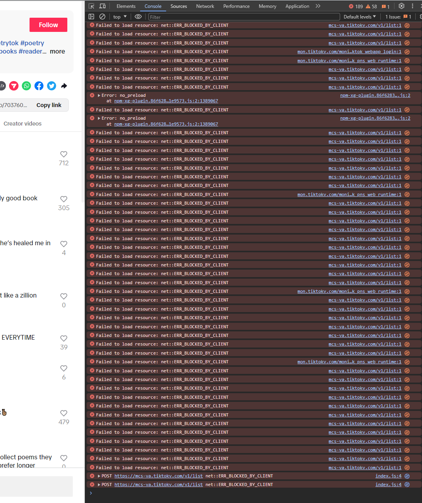
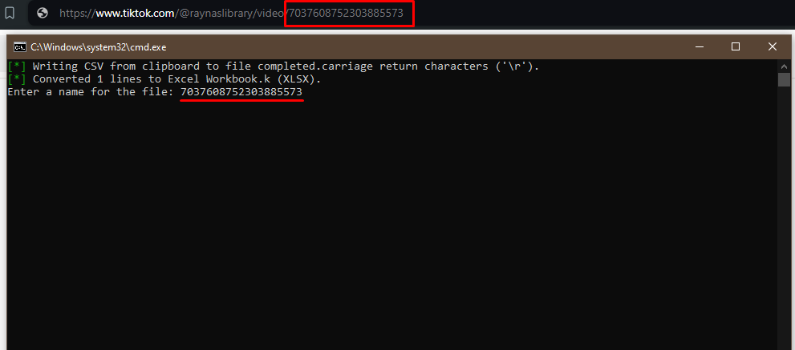
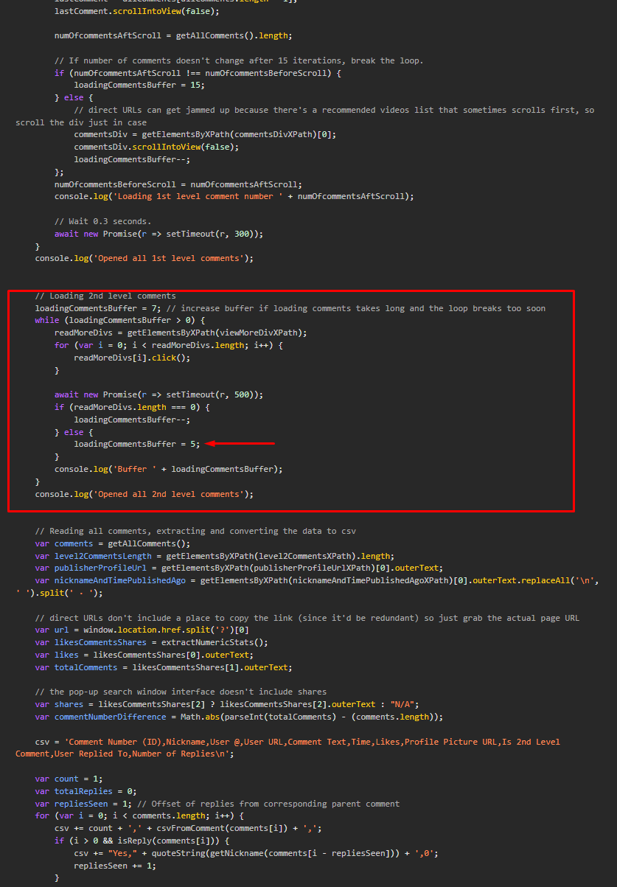

# Functionality
This comment scraper/extractor manages to get all the comments
from virtually any TikTok post. This can be useful for giveaways, votes or other bigger
community interactions.

# Installation
Contrary to convention, this repo does contain the virtual environment it's
running on (**Windows**, for Linux see below), so it's instantly usable also for people who don't want to first install Python and requirements.
The python environment is heavily stripped down (\~7MB).
Installation is as easy as:

`git clone https://github.com/ShamelB/TikTokCommentScraper`

Alternatively, download the zip directly if you don't have git installed from the repistory if you don't have git installed:

# Requirements
Python requirements would be (if you don't want to use the venv or if you aren't using Windows):

`pyperclip`

`openpyxl`

# Usage

### Step 1
Open the main installation folder and click the batch file named 'Copy JavaScript for Developer Console.cmd'.
This will open a command-line terminal and execute the python script that copies the JavaScript code onto your active clipboard.
After running this, feel free to close the terminal or wait for it to auto-close.

### Step 2
Open your Chromium-based browser (Chrome, Brave etc.) and open the TikTok video that you want to download the comments from.
This page will show you the number of comments that are on this TikTok.

### Step 3
Scroll all the way to the bottom of the page until all comments are loaded. 
Press F12, or Shift + CTRL + J on your keyboard to open the Console. Paste the JavaScript code (Reference Step 1) into the console and hit Enter.

You script should take some time to execute with an incremental difference based on how many comments are being scraped, and loaded.
This is what the final output in the console should look like once the script has executed successfully.

### Step 4
Your data is now copied to the clipboard. Open the batch file labelled 'Extract Comments from Clipboard.cmd'.
This file will create an excel workbook and turn the data you have scraped using the console of your browser into it.

### Step 5
Set a name for your new workbook. The name format is 'Scrape_<name_of_your_choice>_SYSTEMDATE'.
You should select an appropriate name. For the purpose of easy recordkeeping, use the video ID in the link:

### Step 6
Once the process is complete, press any key to close the terminal.
Your workbook is now saved in the 'output' folder of your repositroy. Do not worry if you do not see this file, the program is designed to create this folder if it does not exist:

You can also watch this video: https://youtu.be/FsQEm2zalWA
or if you don't have time: https://youtu.be/lYZw75k7QVc

# Debugging

### Infinite Buffer
During Step 3, your script may be stuck in an infite loop of 'Buffer 5'. To work around this, change the buffer value from '5' to '0'
for the section 'Loading 2nd Level comments':

This will ensure you exit out of the loop when trying to load replies/2nd level comments.

# Limits

This comment scraper was tested on a few posts with up to 3000 commments on a
middle-tier laptop where it got a little bit laggy during the comment loading
phase.

Another caveat is TikTok's limitations for showing all comments. Even with
only a few hundred comments, TikTok fails to show the 'correct' number of
comments. E.g. it says in the icon that there are 750 comments but when you
load/render all comments, you only count e.g. 740 comments, which happens
pretty much always with many comments. In the 3000 comments test, 64 comments
were never loaded and therefore not included in the .xlsx file. Fortunately,
this percentage is negligible most of the time.

# Roadmap
1. Enable usage on MacOS (Expected delivery on 14th May, 2024).
2. Rebuild using Python only (Unknown expected delivery).

Credit: All original credit goes to cubernetes for making the original version.
